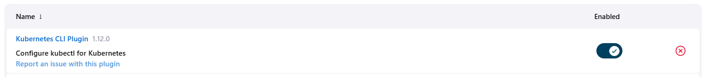
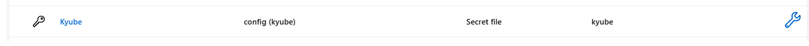
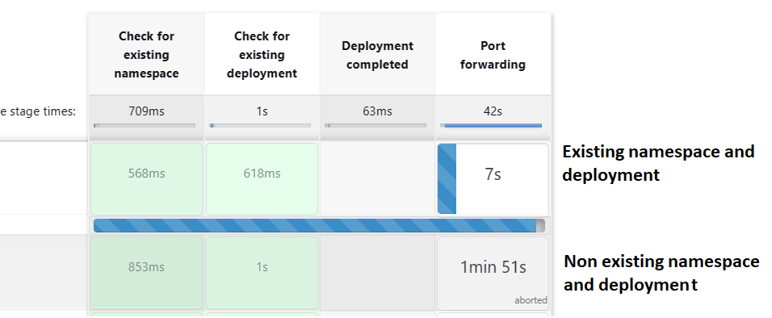
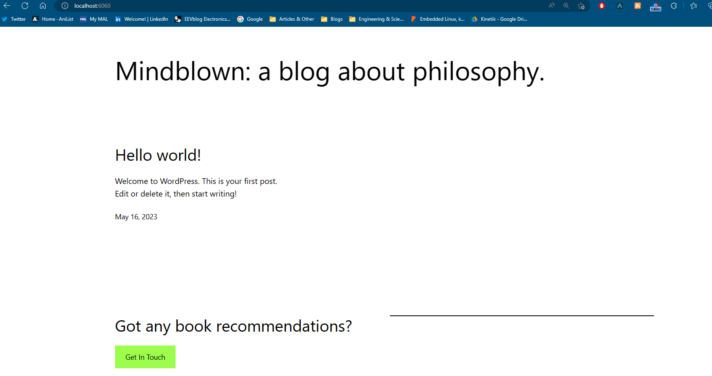

# Final-Project-Assessment-for-Scalefocus-Academy
The finals are upon us

---
### Prerequisites

| Requierment| info              | Installed  |
| ---------- | ----------------- | --- |
| Kubernetes | k3s local kluster | ✅  |
| HELM       | wsl2              | ✅  |
| Jenkins    | wsl2              | ✅  |

Bitnami Wordpres Helm chart - since this is a huge repository and we don't need everything we can use sparse checkout
# Getting the chart
```bash
git clone --depth=1 https://github.com/bitnami/charts.git
cd charts
git config core.sparseCheckout true
touch .git/info/sparse-checkout
echo "bitnami/wordpress" >> .git/info/sparse-checkout
git checkout main

```

And we get get only what we need
```bash
├── charts
│   └── bitnami
│       └── wordpress
│           ├── Chart.lock
│           ├── Chart.yaml
│           ├── README.md
│           ├── templates
│           │   ├── config-secret.yaml
│           │   ├── deployment.yaml
│           │   ├── externaldb-secrets.yaml
│           │   ├── extra-list.yaml
│           │   ├── _helpers.tpl
│           │   ├── hpa.yaml
│           │   ├── httpd-configmap.yaml
│           │   ├── ingress.yaml
│           │   ├── metrics-svc.yaml
│           │   ├── networkpolicy-backend-ingress.yaml
│           │   ├── networkpolicy-egress.yaml
│           │   ├── networkpolicy-ingress.yaml
│           │   ├── NOTES.txt
│           │   ├── pdb.yaml
│           │   ├── postinit-configmap.yaml
│           │   ├── pvc.yaml
│           │   ├── secrets.yaml
│           │   ├── serviceaccount.yaml
│           │   ├── servicemonitor.yaml
│           │   ├── svc.yaml
│           │   └── tls-secrets.yaml
│           ├── values.schema.json
│           └── values.yaml
└── README.md

```
---
# Yaml changes 
From chart.yaml we can see we are pulling images for WordPress, MariaDB, Memecache and Bitnami Common(common templates).
Also i'm taining one of the nodes due to different architecture which might cause Issues during deployments

**Update:** The master node has worn out the sd-card and has failed, I'm moving the k3s to an x86_64 machine


Changing values.yaml from ```type: LoadBalancer -> type: ClusterIP```
Restricting deployment access

# Test run
And we install the helm chart
```bash
helm install wp charts/bitnami/wordpress
NAME: wp
LAST DEPLOYED: Mon May 15 14:18:38 2023
NAMESPACE: default
STATUS: deployed
REVISION: 1
TEST SUITE: None
NOTES:
CHART NAME: wordpress
CHART VERSION: 16.1.2
APP VERSION: 6.2.0
```

Forward the pod adress 
```bash
k port-forward --namespace default svc/wp-wordpress 3030:80
```

Admin page works


Some light blogging 


Server and databasae info


Storage is persistent 


---

# Pipelining with Jenkins

Setting up Kubernetes CLI



Setting up credentials for the cluster



The pipeline is run locally, no github or webhooks

Frist stage - checking for an existing namespace


```groovy
 withKubeConfig([credentialsId: 'Kyube', serverUrl: "${klusterIP}", restrictKubeConfigAccess : true ]) {
                        def isCreated = sh(script: "kubectl get namespaces | grep -q '${namespace}'&& echo true || echo false", returnStdout: true).trim() == 'true'
                        echo "${isCreated}"
                        if (!isCreated) {
                            sh "kubectl create namespace '${namespace}'"
                        } else {
                            echo "Namespace already exists"
                        }
 }
```

Next stage - checking for an wordpress installation in the given namespace and installs it if missing
```groovy
 def isCreated = sh(
                            script: "kubectl get pods -n wp | grep -q '${podName}' && echo true || echo false",
                            returnStdout: true).trim() == 'true'
                            
                        echo "${isCreated}"
                        if (isCreated == false) {
                            sh "helm install ${releaseName} ${chartPath} --namespace ${namespace}"
                        } else {
                            echo "WordPress deployment already exists"
                        }
 }
```

Next stage - waiting for a deployment to finish if wordpress not present 
```groovy
 when {
                expression {
                    script {
                        withKubeConfig([credentialsId: 'Kyube', serverUrl: "${klusterIP}"]) {
                            def deploymentName = sh(
                                returnStdout: true,
                                script: "kubectl rollout status '${rolloutName}' -n wp | grep -q 'successfully' && echo true || echo false"
                            ) == 'true'
                            return deploymentName
                        }
                    }
                }
```


Final step - forwarding the port of the pod where wordpress is located
```groovy
steps {
                withKubeConfig([credentialsId: 'Kyube', serverUrl: 'https://127.0.0.1:6443']) {
                    sh 'kubectl port-forward --namespace wp svc/final-project-wp-scalefocus-wordpress 6060:80'
                }
```

Visual representation of  the pipeline



Port forwarding will stay active until it's cancled or it times out(10 minutes)

---

# Final result


