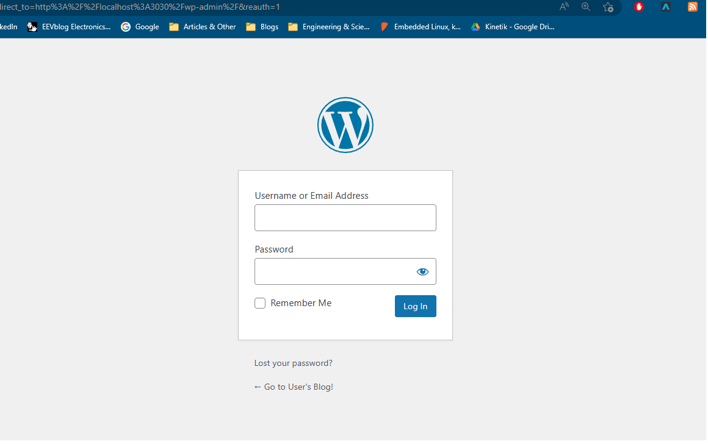
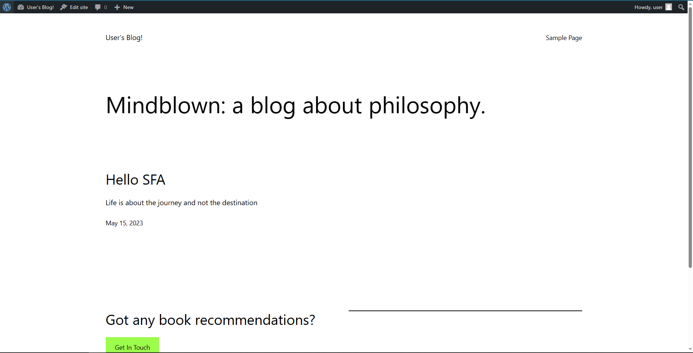

# Final-Project-Assessment-for-Scalefocus-Academy
The finals are upon us

---
### Prerequisites

| Requierment| info              | Installed  |
| ---------- | ----------------- | --- |
| Kubernetes | k3s local kluster | ✅  |
| HELM       | wsl2              | ✅  |
| Jenkins    | wsl2              | ✅  |

Bitnami Wordpres Helm chart - since this is a huge repository and we don't need everything we can use sparse checkout

```bash
git clone --depth=1 https://github.com/bitnami/charts.git
cd charts
git config core.sparseCheckout true
touch .git/info/sparse-checkout
echo "bitnami/wordpress" >> .git/info/sparse-checkout
git checkout main

```

And we get get only what we need
```bash
├── charts
│   └── bitnami
│       └── wordpress
│           ├── Chart.lock
│           ├── Chart.yaml
│           ├── README.md
│           ├── templates
│           │   ├── config-secret.yaml
│           │   ├── deployment.yaml
│           │   ├── externaldb-secrets.yaml
│           │   ├── extra-list.yaml
│           │   ├── _helpers.tpl
│           │   ├── hpa.yaml
│           │   ├── httpd-configmap.yaml
│           │   ├── ingress.yaml
│           │   ├── metrics-svc.yaml
│           │   ├── networkpolicy-backend-ingress.yaml
│           │   ├── networkpolicy-egress.yaml
│           │   ├── networkpolicy-ingress.yaml
│           │   ├── NOTES.txt
│           │   ├── pdb.yaml
│           │   ├── postinit-configmap.yaml
│           │   ├── pvc.yaml
│           │   ├── secrets.yaml
│           │   ├── serviceaccount.yaml
│           │   ├── servicemonitor.yaml
│           │   ├── svc.yaml
│           │   └── tls-secrets.yaml
│           ├── values.schema.json
│           └── values.yaml
└── README.md

```
---
From chart.yaml we can see we are pulling images for WordPress, MariaDB, Memecache and Bitnami Common(common templates).
Also i'm taining one of the nodes due to different architecture which might cause Issues during deployments

Update: The master node has worn out the sd-card and has failed, I'm moving the k3s to and x86_64 machine


Changing values.yaml from ```type: LoadBalancer -> type: ClusterIP```


And we install the helm chart
```bash
helm install wp charts/bitnami/wordpress
NAME: wp
LAST DEPLOYED: Mon May 15 14:18:38 2023
NAMESPACE: default
STATUS: deployed
REVISION: 1
TEST SUITE: None
NOTES:
CHART NAME: wordpress
CHART VERSION: 16.1.2
APP VERSION: 6.2.0
```

Forward the pod adress 
```bash
k port-forward --namespace default svc/wp-wordpress 3030:80
```

Admin page works



Some light blogging 



Server and databasae info


Storage is persistent 


